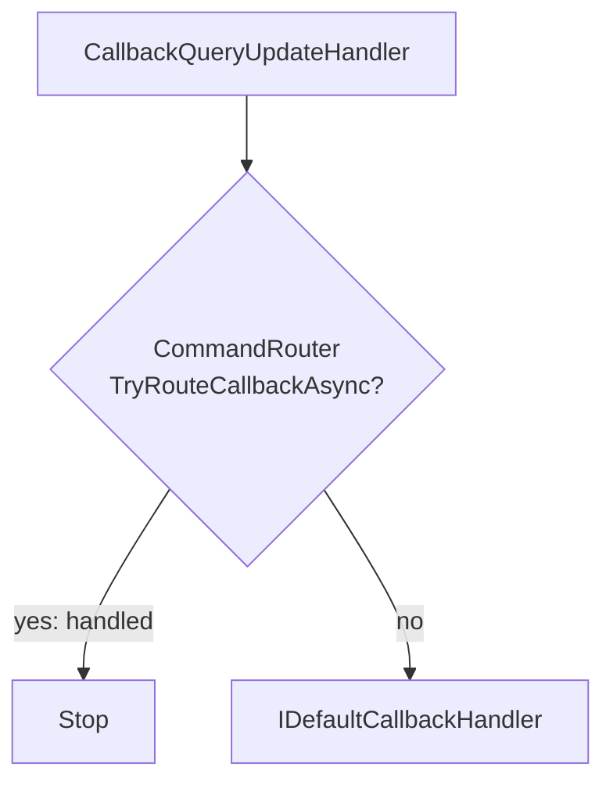

# Processing pipeline

← [Docs index](README.md)

This document explains the **exact order** in which TelegramBotKit processes an incoming `Update`:

- when middleware runs
- when routing runs
- when default (fallback) handlers run
- where `WaitForUserResponse` intercepts messages

If something “does nothing”, this is the page you want.

## High-level flow

```mermaid
flowchart TD
  A[Telegram Update] --> B[Hosting (optional): polling + scheduler]
  B --> C[IUpdateDispatcher.DispatchAsync]
  C --> D[Create DI scope]
  D --> E[BotContext]
  E --> F[Middleware pipeline]
  F --> G[Route by UpdateType]
  G -->|mapped| H[Extract payload]
  H --> I[Resolve IUpdatePayloadHandler<TPayload>[]]
  I -->|0 handlers| J[IDefaultUpdateHandler]
  I -->|1..N handlers| K[Invoke handlers sequentially]
  G -->|not mapped| J
```

Notes:

- Middleware wraps **everything** (routing and fallbacks).
- Routing happens in two steps: **UpdateType → payload → payload handlers**.
- If a route exists but no handlers are registered, TelegramBotKit falls back to `IDefaultUpdateHandler`.

## Detailed order (core)

The core dispatcher (`UpdateRouter`) does this:

1) Create a **per-update DI scope**.
2) Create a `BotContext`.
3) Execute the middleware pipeline.
4) In the terminal step, route the update:
   - if `UpdateType` is mapped → extract payload → dispatch to handlers
   - if `UpdateType` is not mapped → call `IDefaultUpdateHandler`

### Middleware

Middlewares run in the order you register them:

- first registered = **outermost**
- last registered = **innermost**

If middleware does **not** call `next(ctx)`, the pipeline stops and routing will not run.

See: [Middleware](middleware.md)

## Built-in routes and handlers

`AddTelegramBotKit(...)` registers two built-in routes:

- `UpdateType.Message` → `Message` payload → `MessageUpdateHandler`
- `UpdateType.CallbackQuery` → `CallbackQuery` payload → `CallbackQueryUpdateHandler`

All other Telegram update types are **unmapped by default**.
To handle them, add a mapping and a payload handler (see [Updates](updates.md)).

### Message flow

For `UpdateType.Message`, TelegramBotKit runs this logic (in order):

```mermaid
flowchart TD
  M[MessageUpdateHandler] --> W{WaitForUserResponse
TryPublish(message)?}
  W -->|yes: consumed| END1[Stop]
  W -->|no| R{CommandRouter
TryRouteMessageAsync?}
  R -->|yes: handled| END2[Stop]
  R -->|no| D[IDefaultMessageHandler]
```

Key points:

- **Waiters run before command routing.** If a waiter exists for `(chatId, userId)`, the message is “consumed” by `WaitForUserResponse`.
- Command routing checks:
  - slash command (`/start`) first
  - otherwise exact text triggers
- If nothing matches, `IDefaultMessageHandler` is called.

### Callback query flow

For `UpdateType.CallbackQuery`:



Key points:

- Callback routing expects `callback_data` format:

  ```
  {key} {arg1} {arg2} ...
  ```

- If no callback command matches, `IDefaultCallbackHandler` is called.

## Default handlers and when they run

TelegramBotKit has three fallback hooks:

1) `IDefaultUpdateHandler`
   - runs when **UpdateType is not mapped**
   - also runs when UpdateType is mapped but there are **zero** `IUpdatePayloadHandler<TPayload>` registered

2) `IDefaultMessageHandler`
   - runs for `UpdateType.Message` when:
     - the message was not consumed by `WaitForUserResponse`, and
     - no message/text command matched

3) `IDefaultCallbackHandler`
   - runs for `UpdateType.CallbackQuery` when no callback command matched

By default, all fallbacks are **no-ops**.

See: [Commands and routing](commands-and-routing.md) (default handlers section)

## Where you should hook your logic

- **Middleware**: cross-cutting concerns (logging, metrics, auth, throttling, exception boundaries).
- **Commands**: most “bot logic” for messages and callbacks.
- **Default message/callback handlers**: “catch-all” behavior (help text, unknown command reply, etc.).
- **Payload handlers + mapping**: handling other Telegram update types (inline queries, joins, polls, …).

---

Next:

- [Commands and routing](commands-and-routing.md)
- [Middleware](middleware.md)
- [Updates](updates.md)
